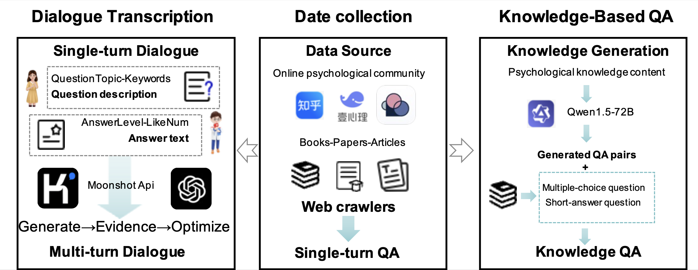
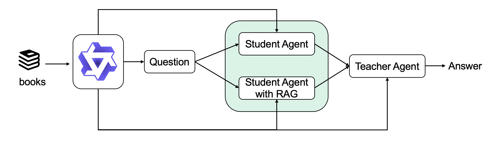

[//]: # (![# PsycoLLM]&#40;assets/logo.png&#41;)

# PsycoLLM: Enhancing LLM for Psychological Understanding and Evaluation
# 中文心理大模型 PsycoLLM
<a href='https://arxiv.org/pdf/2407.05721'></a>
## Latest News

-🥰 [2024.9.22] PsycoLLM is released！More details, click here: [MACLAB-HFUT/PsycoLLM](https://huggingface.co/MACLAB-HFUT/PsycoLLM)🔥🔥🔥


## Introduction

Here is an overview of dataset preparation:


A comprehensive pipeline is used to generate multi-turn dialogue, which includes stages of generation, evidence support, and refinement:


The process for knowledge-based QA generation is:



## Highlights

- We develop a benchmark based on official psychological examinations in China.

- PsycoLLM achieve an accuracy rate surpassing 60\% in averaged MCQs in the proposed benchmark.


## License

This repository is licensed under the [Apache-2.0 License](LICENSE).


## Citation

If this work is helpful, please kindly cite as:

```bibtex
@misc{hu2024psycollmenhancingllmpsychological,
      title={PsycoLLM: Enhancing LLM for Psychological Understanding and Evaluation}, 
      author={Jinpeng Hu and Tengteng Dong and Hui Ma and Peng Zou and Xiao Sun and Meng Wang},
      year={2024},
      eprint={2407.05721},
      archivePrefix={arXiv},
      primaryClass={cs.CL},
      url={https://arxiv.org/abs/2407.05721}, 
}
```

## Acknowledgement

This repo benefits from [PEFT](https://github.com/huggingface/peft), [TRL](https://github.com/huggingface/trl) and [LLaMA Factory](https://github.com/hiyouga/LLaMA-Factory). Thanks for their wonderful works.
