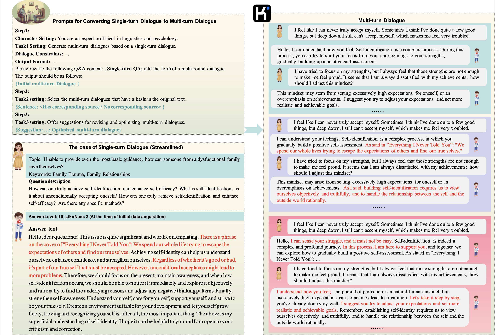

[//]: # (![# PsycoLLM]&#40;assets/logo.png&#41;)

# 中文心理大模型PsycoLLM
<a href='https://arxiv.org/pdf/2407.05721'></a>

Paper here -> PsycoLLM: [Enhancing LLM for Psychological Understanding and Evaluation](https://arxiv.org/pdf/2407.05721)

## 最近更新

-🥰 [2024.9.22] 我们的中文心理大模型PsycoLLM正式发布！如有需要下载模型，请点击此处：[MACLAB-HFUT/PsycoLLM](https://huggingface.co/MACLAB-HFUT/PsycoLLM)

## 项目简介

### - 背景概述
心理健康问题一直备受社会关注。在当代社会，每个人都可能遇上或多或少的难题，在心底慢慢堆积，便可能形成大的心理健康问题。青少年可能是因为校园霸凌、同学相处、原生家庭，年轻人可能是学业繁忙、工作压力大，老年人则可能是缺乏陪伴，需要抒发他们内心的不安与不满，以缓解环绕内心已久的心理问题。为此，我们精心制作了一份数据集，基于此进行大模型的微调，拟用于心理咨询。微调后的大模型在我们构建的评估集上表现优异，其 MCQ 准确率超过60%。

### - 以下是PsycoLLM的数据集准备过程的概览：


### - 以下是一个完整的使用pipeline生成多轮对话的过程，其中包括数据生成、论证支持以及优化阶段：


### - 而生成基于知识的QA问答对的过程则是：


## 亮点

- 我们根据官方的全国心理咨询师考试制作了一个benchmark。

- PsycoLLM 在该benchmark中的平均 MCQ 准确率超过了 60%。

## License

This repository is licensed under the [Apache-2.0 License](LICENSE).


## Citation

If this work is helpful, please kindly cite as:

```bibtex
@misc{hu2024psycollmenhancingllmpsychological,
      title={PsycoLLM: Enhancing LLM for Psychological Understanding and Evaluation}, 
      author={Jinpeng Hu and Tengteng Dong and Hui Ma and Peng Zou and Xiao Sun and Meng Wang},
      year={2024},
      eprint={2407.05721},
      archivePrefix={arXiv},
      primaryClass={cs.CL},
      url={https://arxiv.org/abs/2407.05721}, 
}
```

## Acknowledgement

This repo benefits from [PEFT](https://github.com/huggingface/peft), [TRL](https://github.com/huggingface/trl) and [LLaMA Factory](https://github.com/hiyouga/LLaMA-Factory). Thanks for their wonderful works.
